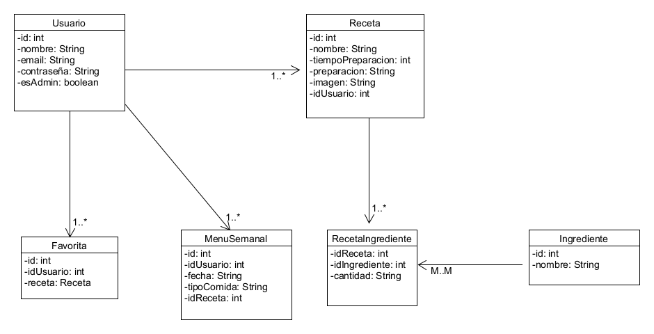
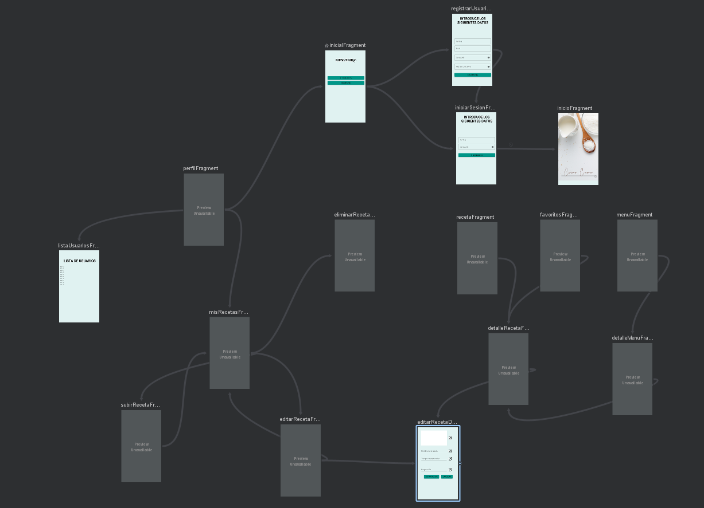
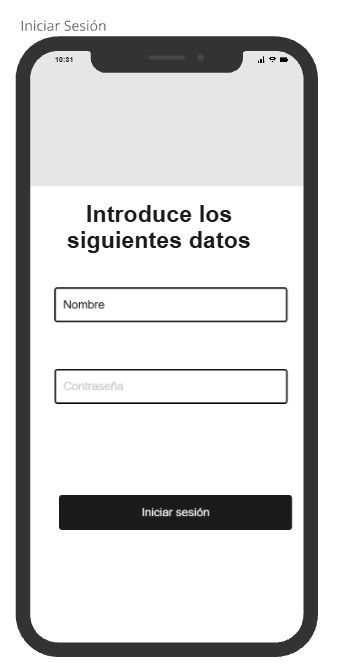
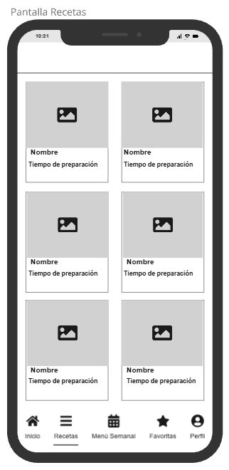

# FASE DE DESEÑO

## Diagrama de clases .

## Casos de uso

**A maiores engado o _nav_Graph_ creado en _Android Studio_**.

## Deseño de interface de usuarios.
**Mockup vs Logrado**

- Pantalla inicial 
  
  

- Pantalla Registrar Usuario

 

- Pantalla Iniciar Sesión

 

- Pantalla inicio

 

- Pantalla Recetas

 

- Pantalla Filtrado Receta

 

- Pantalla Menú 

 

- Pantalla Favoritos 
  
 

- Pantalla Perfil

 

- Pantalla Mis Recetas

 

- Pantalla Subir Receta

    

- Pantalla Editar Receta

  

- Pantalla Eliminar Receta

 

- Pantalla Perfil Admin

 

- Pantalla Eliminar Usuarios

 

- Pantalla Detalle Receta

 

- Pantalla Detalle Receta Si Receta Creada por Usuario Logeado

 

- Pantalla Detalle Menu

 

## Diagrama de Base de Datos.

